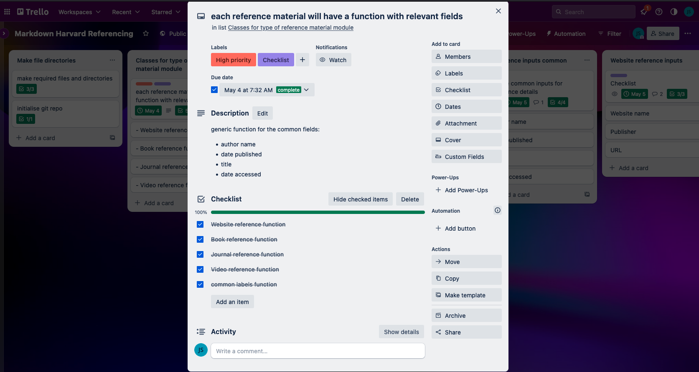
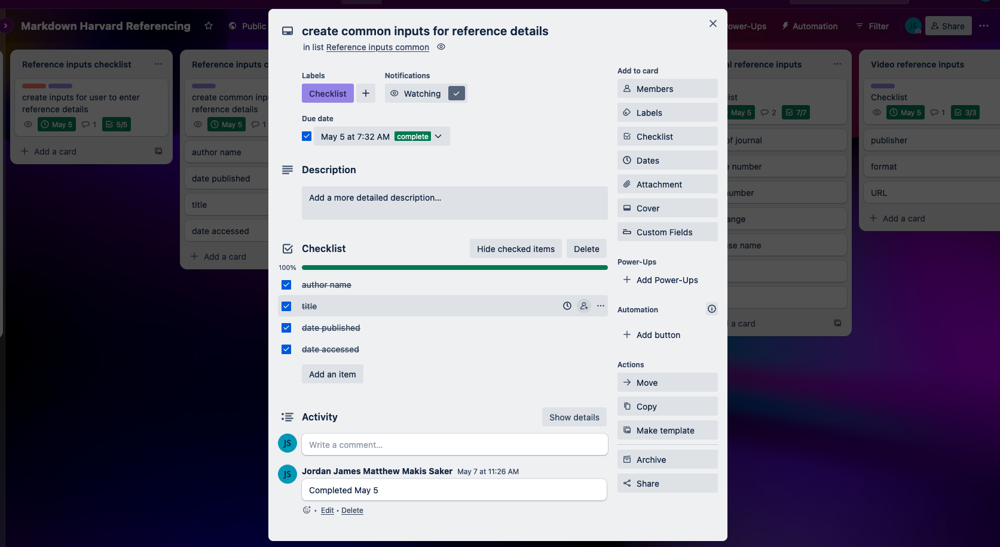
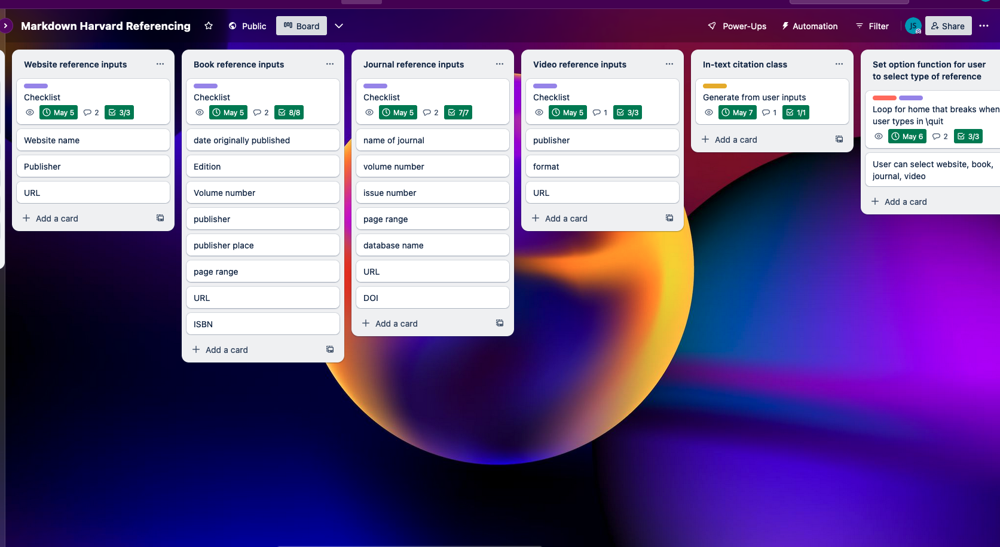

# Harvard Referencing Generator for Markdown

### Github repository

URL: https://github.com/jordansaker/TerminalAppT1A3

### Youtube link

URL: 

### Code Styling Conventions

### Features of the Application

- structures the inputted strings into a Harvard-style referencing format depending on refernece type
- inserts reference list from **references.txt**, and in-text citations from **citations.txt** into a **.md** file
- allows user to search for numbered references from **.txt** file
- allows user to edit or delete references in **.txt** file and rewrite over the existing file
- file handling

#### Havard Formatted string output
The main feature of the application generates an outputtted string which sorts a series of user inputs into the correct format fo a Harvard reference stye. The application can generate outputs for 4 different types of reference sources, websites, books, journals, and videos. Along with a reference list output, the application also generates the in text citation for each reference that is generated. Both the reference list and the citations lists are outputted to text files **references.txt** and **citations.txt** respectively.


#### Inserting References and Citations into desired documents

The references and citations can be inserted into a selected markdown document. A user is able to build a reference list and can then insert the list to a specfic spot in the markdown document. The user can then flag in-text references based on a reference number and the application will insert the corresponding citation for the reference number.

#### Searching for References and Editing or Deleting References

The user will be able to search for a reference from the reference list. This can be done either by the author's last name or by the reference number. The returned results can then be selected by the user using the reference number, which will then allow the user to either edit the reference or delete it permanently from the list. When the user deletes the reference, it's citaiion is deleted as well.

#### File handling
The application reads and writes into both a **.txt** and **.md** file. When the inserting options are selected the user is able to specify the markdown file name that they want to insert either the references or citations into.

The user also has the option of deleting the entire reference list file which will also delete the citations file.


### Implementation Plan

#### File handling

The file handling feature will be implemented by creating a file_handling module which will contain functions that have a try/except/finally block within these functions.

The functions will be able to handle a **.txt** and a **.md** file.

The file names will be passed to the functions as an argument, the file name coming from a user input. For the **.txt** file, the file can then be changed by adding text to it or if the user is ready to insert the text in the file into a **.md** file, the text is copied and placed into a temporary varible ready to be used to write into the **.md** file.

Since the inserting and search features depend on file handling, this will be one of first functions of the application to be implemented. Two days was given to implement the core functionality of the file handling module.

#### Harvard-style referencing

The application will take inputs from the user, mainly information about a specific source of information that they would like to be referenced too. So the inputs will ask for details such as author's name, date published, date accessed, title, URL, etc. There will be four types of reference sources that can be formatted to the Harvard style. They are websites, books, journals, and videos. For each reference source, a function will be created for the unique inputs, while another function will be have the common inputs.

Each time a user selects the type of reference source, the relevant functions will be called to allow the user to input the information.

There will also be a builder function for each reference type. These functions will be called after the input functions. Inside these functions, the reference block will be generated. A citation for the reference will also be generated.

Because this is the core part of the application, this feature will be built first and a duration of one day is given to implement this feature.

#### Inserting reference list and in-text citation into .md file

Copying the reference list and in-text citation from the text files, the application will insert the text into a **.md** file. When the application handles the reference list, it will look for a flag [\References], and insert the entire reference list in place of the flag.

For the in-text citation, because the references will be numbered, the flags in the **.md** will correspond to a reference number i.e. [1] will correspond to reference 1 in the list. The in-text citation for reference 1 will then be inserted and replace the flag.

The following feature will use a search function to find the flags in the **.md** file. In the case of citations, a loop will be used in combination with the serach function to comb the file for flags and input the citations. A regular expression will be used to search for the citation flags as they will be among other text compared to the references flag will will be on it's own line.

#### Search and edit existing references in .txt file

The user will be able to search and edit existing references. Since each reference will be numbered, the user can use the reference number to call up and update the reference.

Another method of editing can be by searching the **.txt** file for the author's name. The search will return and print to the terminal a list of references with matches, including the reference number. The user can then call a reference up using the number.

This feature will use an indexing method since a **.txt** file is converted to a list. So when a user enters a number, that will correspond to the reference number but will be related back to the index number by subtracting 1.

If the user types in the authur's last name, a regular expression will be used to match the author's name in the string.

Since this is a low level feature, the priority of implementation isn't as high. This feature is given two days to implement.


#### Project Management - Trello

Below are some screenshots of Trello which was used to track the implementation of the application. Most lists had a checklist with cards containing small tasks that eventually added up to completing the list.







### Installing the application

#### Required Dependencies

autopep8 version 2.0.2
colorist version 1.5.1
iniconfig version 2.0.0
packaging version 3.1
pluggy version 1.0.0
pycodestyle version 2.10.0
pytest version 7.3.1

#### Installation

The prerequisite for installing the application is Python version 3 as the app was built using version 3 and was not tested on 2.x.

Before the bash file can be run, you will need to change the file's permissions to be abled to be an executable. In the same working directory as the ```harvref.sh``` file you need to type the following in the terminal:

``` chmod +x harvref.sh ```

The dependencies of the application are handled by the ```harvref.sh``` shell script. If for some reason the script does not run or install the packages you will need to first create a virtual environment using the following terminal command in the source file directory:

``` python3 -m venv .venv ```

Then activate the virtual environment:

``` source .venv/bin/activate ```

The source file should contain a **requirements.txt** file, if it does not, place the required dependencies above into a **requirements.txt** file and replace the "version" with "==" i.e. ```autopep8==2.0.2```. Then run this command in the terminal:

```python3 -m pip install -r requirements.txt```

The application environment should now be installed. To run the application enter the following command in the terminal:

``` python3 main.py ```

#### How to use the application

##### Using the bash script arguments

The application can be used

##### Adding New References

##### Inserting References and Citations into a Markdown File

##### Searching, Editing, Deleting Reference

##### Deleting the the entire Reference and Citation Lists

